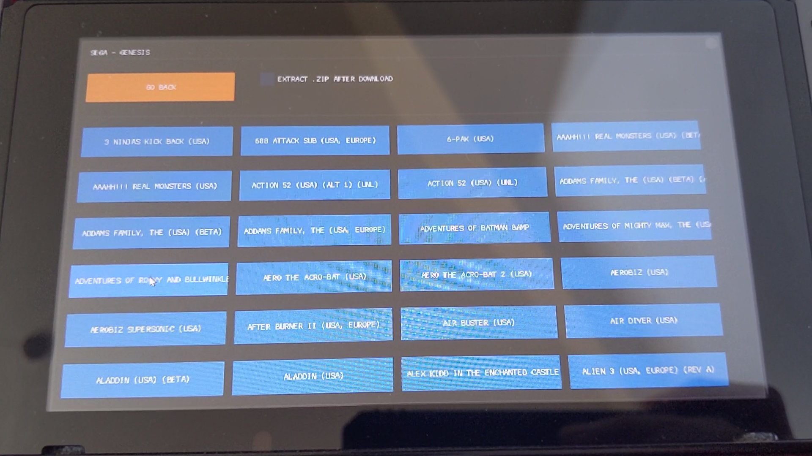
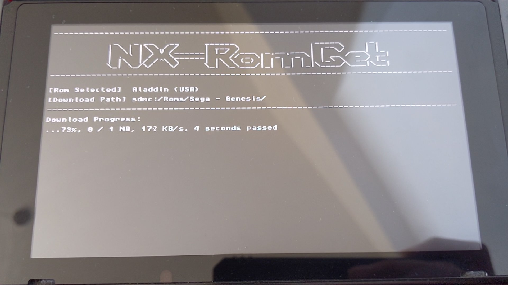

# NX-RomGet

Download ROMs directly on the switch from user provided list (.txt)

Requires: [PyNx](https://github.com/nx-python/Pynx)

**Touch** support only

# Guide:

1. Download PyNx and extract to sdmc:/switch/PyNx
2. Download NX-RomGet (main.py) and overwrite PyNx main.py
3. Create txt files in the PyNx folder in the following way
 
(a) File name will determine where to save ROMs
    Ex; "Sega - Genesis.txt" will save ROMs from that list under sdmc:/Roms/Sega - Genesis/
 
(b) Each row will include name and download link separate by semi colon
    Ex; "Sonic 3 (USA);http://link.com/Sonic3.zip"
   
 **NOTE:** HTTPS link will give error, so try to rename to HTTP

# Screenshots:

